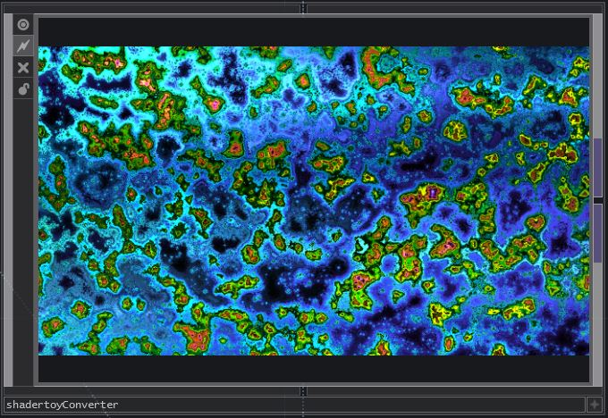
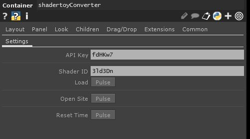
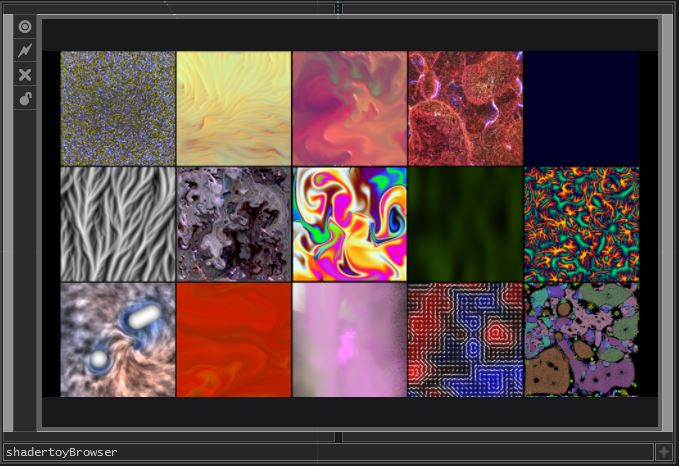
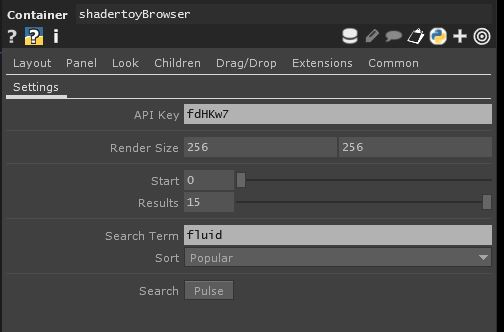

# td-shadertoy


**td-shadertoy.toe** contains a collection of components that can be used to load shaders from Shadertoy into TouchDesigner via the Shadertoy API.

[Shadertoy API Documentation](https://www.shadertoy.com/howto)


## shadertoyConverter



- Requests the json object from the API
- Modifies the shader code
- Generates and routes the samplers



- **API Key**
	- Can be created at [shadertoy.com/myapps](https://www.shadertoy.com/myapps)
- **Shader ID**
	- The ID of the shader to download e.g. shadertoy.com/view/**3ld3Dn**
- **Load**
	- Load the shader
- **Open Site**
	- Open up the shader in a web browser
- **Reset Time**
	- Reset the internal clock to 0


## shadertoyBrowser



- Uses the API to return a list of shader IDs
- Uses a replicator to copy the shadertoyConverter for each returned ID



- **API Key**
	- Can be created at [shadertoy.com/myapps](https://www.shadertoy.com/myapps)
- **Render Size**
	- Set the resolution of each shader
- **Start**
	- Set the start index of the search
- **Results**
	- The max number of results to return
- **Search Term**
	- The search query
	- Leaving this blank will search all
- **Sort**
	- The method to sort the search results


## Converting Shadertoy to TouchDesigner

There are several differences listed below that need to be addressed in the shader code. This is done automatically when the **shadertoyConverter** component loads a shader.

- ShaderToy provides a default set of useful uniforms. These can simply be prepended to each shader's code and added in the uniform parameters of the glsl TOP. 

```
uniform vec3      iResolution;           // viewport resolution (in pixels)
uniform float     iTime;                 // shader playback time (in seconds)
uniform float     iTimeDelta;            // render time (in seconds)
uniform int       iFrame;                // shader playback frame
uniform float     iChannelTime[4];       // channel playback time (in seconds)
uniform vec4      iMouse;                // mouse pixel coords. xy: current (if MLB down), zw: click
uniform vec4      iDate;                 // (year, month, day, time in seconds)
uniform float     iSampleRate;           // sound sample rate (i.e., 44100)
```

- The Shadertoy main loop is called **mainImage()** rather than **main()** and expects texture coordinates in pixel space. This can be addressed by appending the following **main()** function code which calls **mainImage()** and passes in the color buffer as well as the expected pixel coordinates. 

```
layout (location = 0) out vec4 TDColor;
void main()
{
	mainImage(TDColor, vUV.st*iResolution.xy);
}
```

- In TouchDesigner, samplers are provided as array objects named **sTD2DInputs** and **sTDCubeInputs** for cubemaps. Shadertoy refers to all types of samplers as iChannel therefore the sampler names must be substituted according to the sampler type. 

```
if ctype == 'cubemap':
	code = code.replace('iChannel' + str(channel), 'sTDCubeInputs[' + str(channel) + ']')
	code = code.replace('iChannelResolution[' + str(channel) + ']', 'vec2(uTDCubeInfos[' + str(channel) + '].res.zw)')
else:
	code = code.replace('iChannel' + str(channel), 'sTD2DInputs[' + str(channel) + ']')
	code = code.replace('iChannelResolution[' + str(channel) + ']', 'vec2(uTD2DInfos[' + str(channel) + '].res.zw)')
```

- iChannelResolution must also be modified to use the TouchDesigner provided texture info array **uTD2DInfos**.

```
code = re.sub(r'iChannelResolution\[(\d)\]', r'vec2(uTD2DInfos[\1].res.zw)', code)
```

- If an additional **common** file is used, a reference must be included.

```
code += textwrap.dedent('''
#include <../common>
''')
```

## Known Issues

- Not all shaders are made available in the API as the shader's creator must choose to allow the shader to be available in the API when they publish it. Some publicly published shaders will not load because this option was not selected.

- Shaders that rely on specific sampler wrap and filter conditions may have issues displaying correctly. In Shadertoy, users are allowed to set these settings individually for each shader's input channel but the glsl TOP in TouchDesigner only allows the user set this globally.